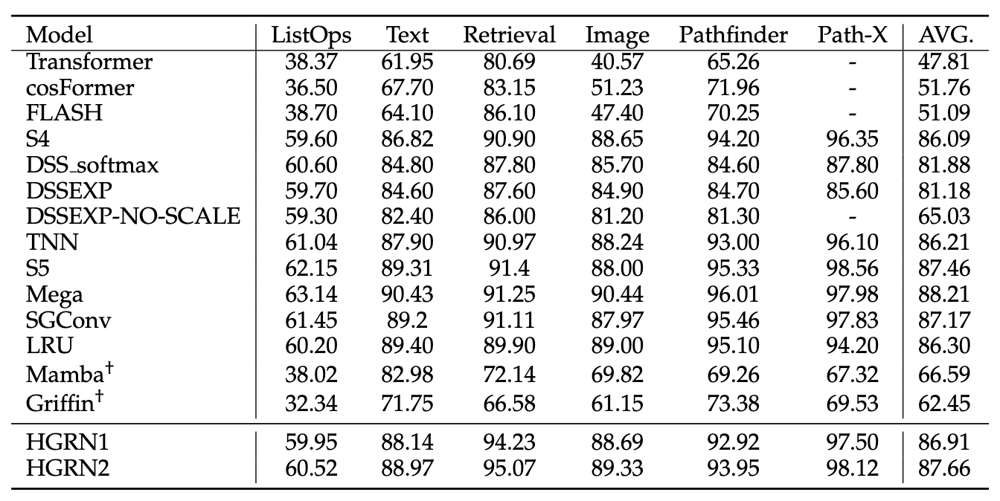
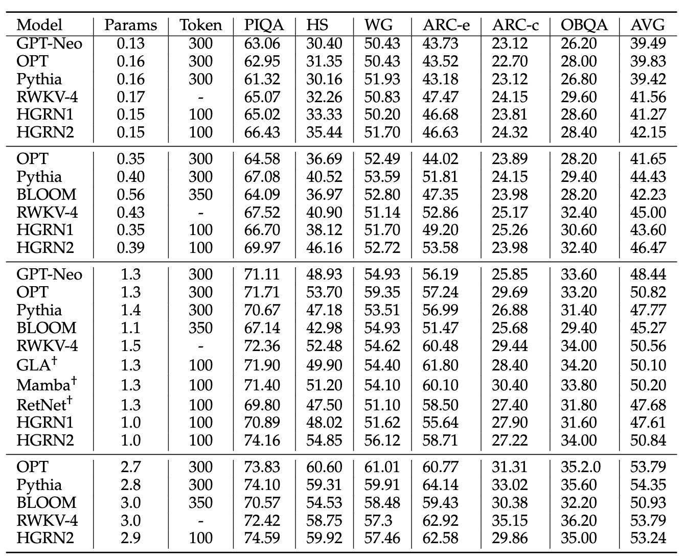
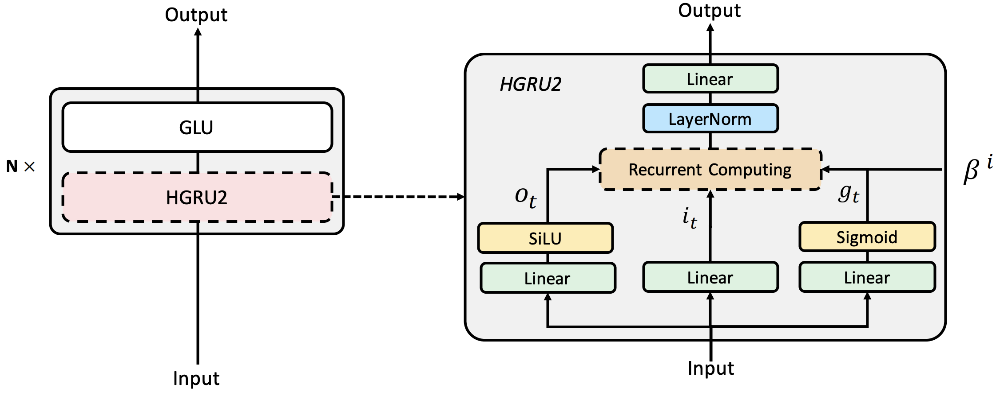

# HGRN2

Official implementation of `HGRN2: Gated Linear RNNs with State Expansion`. This repo does not contain specific codes, but only scripts and some instructions on how to reproduce the results of the paper. The overall directory is as follows:

- [HGRN2](#hgrn2)
  - [Main result](#main-result)
  - [Overall Architecture](#overall-architecture)
  - [Algorithm](#algorithm)
  - [Standalone code](#standalone-code)
  - [Experiments](#experiments)
    - [Environment Preparation](#environment-preparation)
      - [Env1(for lra experiments)](#env1for-lra-experiments)
      - [Env2(for imagenet)](#env2for-imagenet)
      - [Env3(for wikitext)](#env3for-wikitext)
      - [Env4(for mqar)](#env4for-mqar)
    - [Wikitext-103](#wikitext-103)
      - [1) Download the data](#1-download-the-data)
      - [2) Train the autoregressive language model](#2-train-the-autoregressive-language-model)
    - [Image modeling](#image-modeling)
    - [LRA](#lra)
      - [1) Preparation](#1-preparation)
      - [2) Training](#2-training)
    - [Mqar](#mqar)


## Main result

We list the main experimental results in the table below; for the complete experimental results, please refer to the paper.






## Overall Architecture

The overall network architecture is as follows:

<div  align="center"> </div>

## Algorithm

The modification to hgrn2 is very simple. Compared to hgrn1, the recursive formula becomes:

$$
\begin{equation}
\begin{aligned}
    \mathbf h_t  &= \mathrm{Diag}\{\mathbf f_t\}  \cdot
\mathbf h_{t-1}
+(1- \mathbf f_t) \otimes  \mathbf  i_t \in \mathbb R^{d\times d}, \\
   \mathbf{y_t} &= \mathbf o_t \cdot \mathbf h_t \in \mathbb R^{1 \times d},    
\end{aligned}
\end{equation}
$$

where $\otimes$ denotes out product, and $\cdot$ denotes inner product.

Key insights:

1. Expand memory is quite import.
2. Outproduct is a parameter efficient expanding methods.
3. Transitioning from linear RNN to linear attention. (The output gate plays the role of Q, (1 - forget gate) plays the role of K, and the input state plays the role of V.)
4. No need extra parameters to represent forget gate like GLA/Mamba.

## Standalone code
See [hgru2-pytorch](https://github.com/Doraemonzzz/hgru2-pytorch). In order to reproduce the experimental results, please use the reproduce branch!
The other implementations come from [fla](https://github.com/sustcsonglin/flash-linear-attention/tree/main/fla/models/hgrn2), thanks for [yzhangcs](https://github.com/yzhangcs)'s implementation.

## Experiments

### Environment Preparation

Our experiment uses several conda environments.

#### Env1(for lra experiments)

First build the conda environment based on the yaml file:

```
conda env create --file lra.yaml
```

Then, install `hgru-pytorch`:
```
conda activate lra
git clone https://github.com/Doraemonzzz/hgru2-pytorch
cd hgru2-pytorch
pip install .
```

#### Env2(for imagenet)

Build the conda environment based on the yaml file:

```
conda env create --file im.yaml
```

Then, install `hgru-pytorch`:
```
conda activate lra
git clone https://github.com/Doraemonzzz/hgru2-pytorch
cd hgru2-pytorch
pip install .
```

#### Env3(for wikitext)
Regarding the wikitext-103 experiment, we provide the main version dependencies:
```
torch==2.0.1
triton==2.0.0
triton-nightly==2.1.0.dev20230728172942
```
After setting up the basic environment, you need to use our version of fairseq:
```
git clone https://github.com/OpenNLPLab/fairseq-evo.git
cd fairseq-eva
pip install -e .
```

#### Env4(for mqar)
Regarding the mqar experiment, we provide the main version dependencies:
```
torch==2.0.1
triton==2.1.0
```
After setting up the basic environment, you also need fla:
```
git clone https://github.com/sustcsonglin/flash-linear-attention
cd flash-linear-attention
pip install -e .
```


### Wikitext-103

#### 1) Download the data

First download the wikitext-103 dataset:
```
git clone https://huggingface.co/datasets/OpenNLPLab/wikitext-103
```


#### 2) Train the autoregressive language model

Use the following command to train language model:

```
bash script_lm.sh arch num_gpus data_dir
```
where `arch` is chosen from
```
hgrn2_lm_expand2
hgrn2_lm_outproduct_1
hgrn2_lm_outproduct_2
hgrn2_lm_outproduct_4
hgrn2_lm_outproduct_8
hgrn2_lm_outproduct_16
hgrn2_lm_outproduct_32
hgrn2_lm_outproduct_64
hgrn2_lm_outproduct_128
```
`num_gpus` is the number of gpus and `data_dir` is wikitext-103's path.


### Image modeling

First clone the following codebase:
```
git clone https://github.com/OpenNLPLab/im.git
```
Then change the `PROG` and `DATA` in `script_im.sh`, finally run the following script
```
python run_im.py
```


### LRA

#### 1) Preparation

Download the raw data:
```
wget https://storage.googleapis.com/long-range-arena/lra_release.gz
mv lra_release.gz lra_release.tar.gz 
tar -xvf lra_release.tar.gz
```
Or download the preprocessed data:
```
git clone https://huggingface.co/datasets/OpenNLPLab/lra
```

Clone the following repo:

```
git clone https://github.com/OpenNLPLab/lra.git
git checkout release_torch2
```

Change the `DATA_PATH` and `program_path` in `script_lra_others.sh` and `srcipt_lra_image`.


#### 2) Training

Use the following script to run the experiments:

```
python run_lra.py
```

### Mqar
First change the `code_dir` and `cache_dir` in `script_mqar.sh`, then run the following script:
```
bash script_mqar.sh
```


